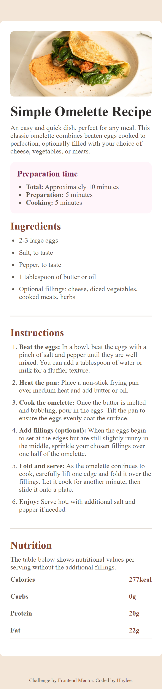
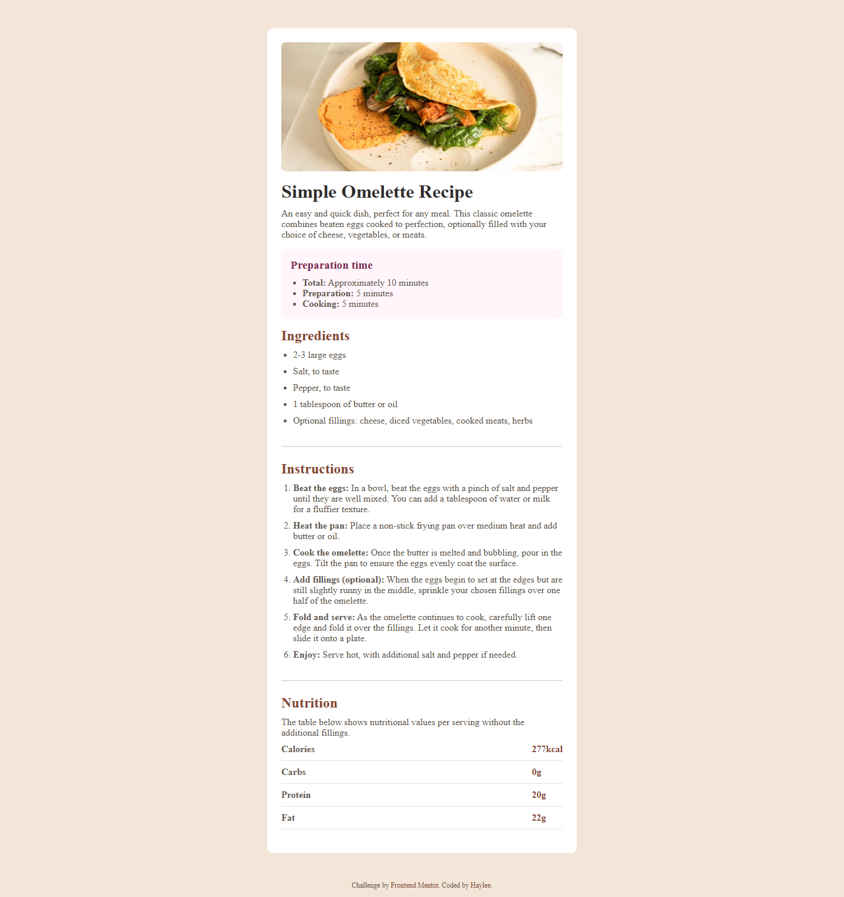

# Recipe Card 🚀

## Overview
This is a simple recipe card that uses unorderd lists, ordered list, and a table.

### Built With
🔴 Semantic HTML

🔴 CSS Custom Properties

🔴 CSS Flex

### Preview

  

    <b>Mobile Design:</b>
  

  

    
  

  

    <b>Desktop Design:</b>
  

  

    
  

